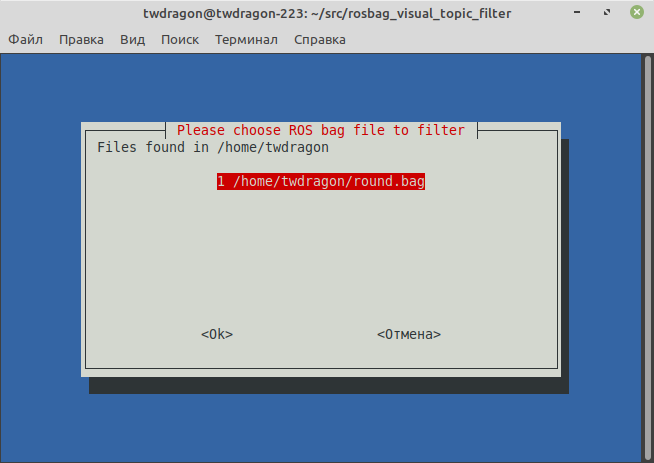
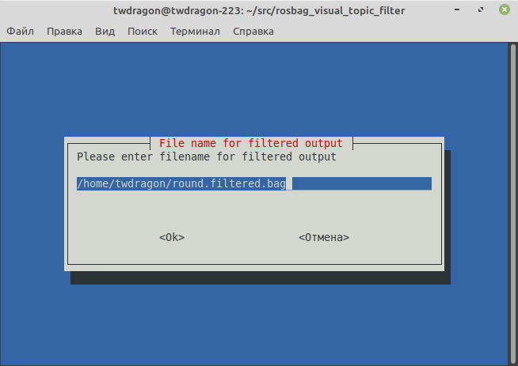
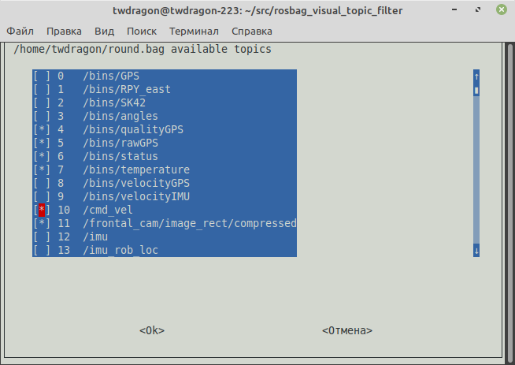
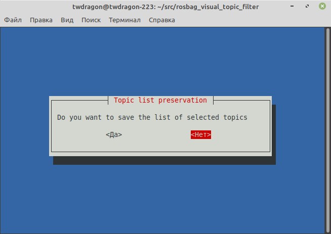

# Visual ROS topic selector for .bag files

This script allows [ROS](https://www.ros.org) user to produce .bag files filtered by topic names. It uses simple CLI syntax and list files to select which topics recorded into .bag file should be left there after filtering. 

## Usage

```sh 
rosbag-visual-topic-selector [OPTIONS]
```

### Command line options

|**Option**|**Argument**|**Meaning**|**Description**|
|----------|------------|-----------|---------------|
|`-d`|path to directory|Base directory|The script reads `.bag` files from the directory on which it is being run by default. To override this, use this option|
|`-t`|topic name|Select topic by name|If the topic mentioned in argument exists in source bag file, it will be selected in [graphic interface](#graphic-user-interface) at the moment it has being appeared. This option could be mentioned several times for several topic names|
|`-c`|path to file|Topic list file|This option permits to use list file where topics are enumerated (one topic per line) to be extracted to destination file. All mentioned topics will be selected in [graphic interface](#graphic-user-interface) at the moment it has being appeared if they exist in source bag file|
|`-r`|  |Replace flag|The destination bag file can be replaced with new one with the same name only if this flag was specified|
|`-h`|  |   |Shows online help|

### Graphic user interface

After being run, the script shows an initial window where all `.bag` files located in base directory (see [Command line options](#command-line-options)) are enumerated. This window allows to select `.bag` file to filter. User can just press `ENTER` to select the first `.bag` file from the list.



After that it is time to enter name for destionation `.bag` file. The default one is the source file name with `.filtered` suffix added before `.bag`.



The source `.bag` file is now checked by `rosbag`. If the check reports no errors, the next window appears allowing user to select topics for transfer into destination bag. Note that if [`-c` or `-t` command line options](#command-line-options) have been used, the topics mentioned there are selected in the list.



After that the request is being given to user to save the list of topics which he selected before into list file. The default name of this file is `topics.filter`.



After all operations were permitted by user wihout `Cancel` switch selection, the source `.bag` file will be filtered into destination one preserving topics which were selected.

